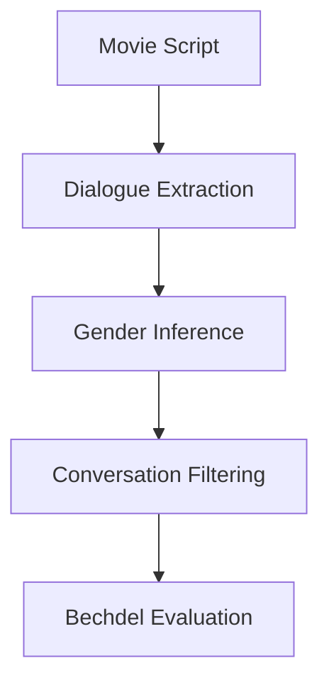

# :movie_camera: An Automated Bechdel Test

Automatically evaluates movie scripts against the Bechdel Test using DocETL + LLM reasoning.


## :film_strip: :woman_technologist:

The Bechdel Test is a rule for assessing the agency of women in movies.

A movie passes the test if:

1. Two named women speak to each other
2. Their conversation is about something other than a man

## :rocket: Tech Overview

The DocETL pipeline this repository uses is as follows:

1. Extract potential dialogue and character names
2. Infer character genders (🤖 **Femputer**)
3. Filter conversations involving women
4. Evaluate whether the script passes the Bechdel Test using LLM reasoning (🤖 **Femputer**)



Pixi is used to manage dependencies.

## :hammer_and_wrench: Installation and Setup

Pixi installation can be found at: https://pixi.prefix.dev/latest/installation/.

This project requires an LLM API key.

A sample `.env` file is provided.

DocETL uses LiteLLM under the hood, so many providers are supported.

The default model, `gemini-2.5-flash`, has a **free tier** with a limited number of queries per minute and per day.

To change models:

1. Add the appropriate API key to `.env`
2. Update `default_model` in `run_bechdel.py`

---

## :open_file_folder: Project Structure

Several sample movie scripts have been provided in the `data/raw` subfolder.
Many more scripts can be found on https://imsdb.com/.

```bash
├── LICENSE
├── README.md
├── data
│   └── raw
│       ├── 10_things_..._you.txt
│       ├── 500_days_of_summer.txt
│       ├── barbie.txt
│       ├── futurama.txt
│       └── joker.txt
├── pixi.lock
├── pixi.toml
└── src
    ├── create_json.py
    ├── prompts.py
    ├── run_bechdel.py
    └── utils.py
```

## :dizzy: Commands

The pixi environment is activated with

```bash
pixi shell
```

The `run_bechdel.py` script takes one argument, the location of the script `.txt` file.
The following command runs the Bechdel Test on the barbie movie.

```bash
python src/run_bechdel.py data/raw/barbie.txt
```

## :low_brightness: Limitations

- The pipeline may miss dialogue in scripts with non-standard formatting
- Character gender inference is highly imperfect
- The Bechdel test alone is an incomplete measure of representation. Adding a parallel map operation with varied degrees of Bechdel Test strictness could allow for a more nuanced scoring system.
